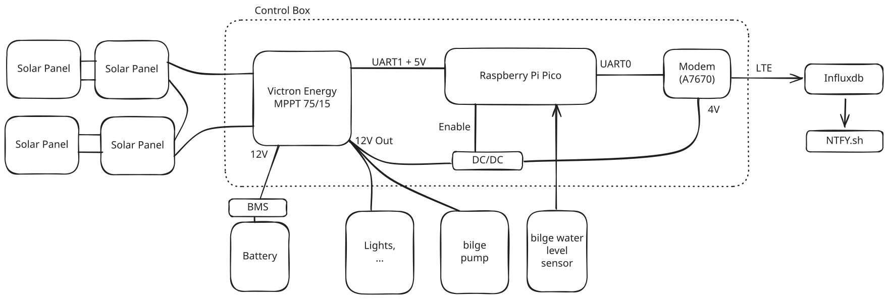

# Boat Monitor
monitoring that our 1962 wooden sailboat does not sink.

Wooden boats are inherently not 100% watertight. Thus they constantly need to have water pumped out
of the bottom of the boat (the bilge). In our sailboat we do this with an electric pump that is 
powered by solar panels and a battery. To ensure that everything works, we want monitoring. This
repo documents the hard / and software to acomplish that.

